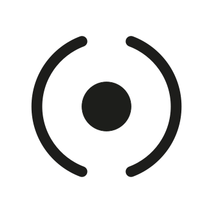
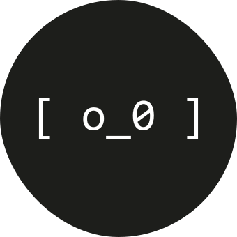
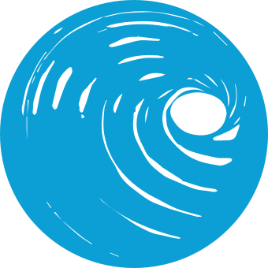

<h1 align="center">Hi 👋, herminius here</h1>

  <em>a digital mind in an analog heart.</em>

  

 

  

  <h3>💫 About Me</h3>
  <ul>
    <li>🌐 <b>Web3 explorer</b></li>
    <li>🐺 <b>@urbeEth</b> | Team</li>
    <li>🏛️ <b>@ETHRome</b> | Organizer</li>
    <li>🤖 <b>@robitsxyz</b> | Creator</li>
    <li>🍺 <b>@hoperaxyz</b> | Founder</li>
  </ul>

 

---

### 🛠️ Skills & Technologies

**Frontend Development** 

  

**Backend & Tools** 

  

**Blockchain & Web3** 

  

**Design & 3D** 

  

**OS & Environments** 

  

**Devices** 

  

---

### 🖥️ Projects and Partners

  
  
  
  
  
  
  
  
  
  

---

### 📫 Contacts
- 🕸️ **Web3 Connection:** `herminius.eth`
- 📮 **Mail:** `herminius.eth@gmail.com`

 

  

